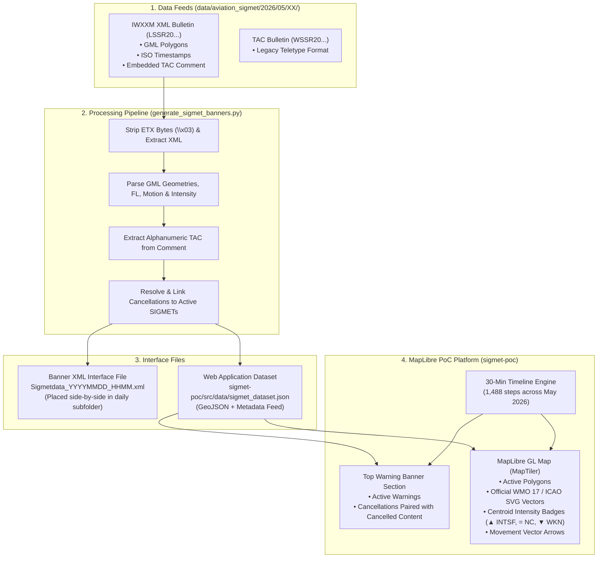

# APAC SIGMET Operations & Timeline Monitor

[](https://songhan89.github.io/sigmet-wiw2-gemini/)
[](https://vitejs.dev/)
[](https://react.dev/)
[](https://maplibre.org/)
[](https://tailwindcss.com/)

A modern, production-ready reference implementation for ingesting, parsing, auditing, and interactively visualizing **Significant Meteorological Information (SIGMET)** across the **Singapore (WSJC)** and **Jakarta (WIIF)** Flight Information Regions (FIRs).

🌐 **Live Application**: [https://songhan89.github.io/sigmet-wiw2-gemini/](https://songhan89.github.io/sigmet-wiw2-gemini/)

---

## 📖 Table of Contents
1. [System Concept & Operational Background](#-system-concept--operational-background)
2. [End-to-End Architecture & Data Flow](#-end-to-end-architecture--data-flow)
3. [Interface Files Specification](#-interface-files-specification)
   - [Source WMO/GTS Bulletins (`LSSR*` and `WSSR*`)](#1-source-wmogts-bulletins-lssr-and-wssr)
   - [The Banner XML Interface File (`Sigmetdata_*.xml`)](#2-the-banner-xml-interface-file-sigmetdata_xml)
   - [The Web Application Dataset (`sigmet_dataset.json`)](#3-the-web-application-dataset-sigmet_datasetjson)
4. [Legacy Pipeline Audit & Flaws Resolved](#-legacy-pipeline-audit--flaws-resolved)
5. [Developer Implementation Guide](#-developer-implementation-guide)
   - [Step 1: Bulletproof IWXXM & Embedded TAC Parsing](#step-1-bulletproof-iwxxm--embedded-tac-parsing)
   - [Step 2: Cancellation Resolution & Pairing Algorithm](#step-2-cancellation-resolution--pairing-algorithm)
   - [Step 3: GML to GeoJSON Coordinate Transformation](#step-3-gml-to-geojson-coordinate-transformation)
   - [Step 4: Vector Graphics & Intensity Representation](#step-4-vector-graphics--intensity-representation)
   - [Step 5: 30-Minute Time Simulation Engine](#step-5-30-minute-time-simulation-engine)
6. [Repository Structure](#-repository-structure)
7. [Running and Deploying](#-running-and-deploying)
8. [Aviation Standards & References](#-aviation-standards--references)

---

## ✈️ System Concept & Operational Background

### What is SIGMET?
SIGMET (Significant Meteorological Information) is a safety-critical aviation weather advisory issued by a **Meteorological Watch Office (MWO)** (such as Singapore Changi MWO `WSSS`). It alerts air traffic control (ATC), airlines, and pilots to en-route weather phenomena that may severely impact aircraft safety, including:
- **Embedded Thunderstorms (`EMBD_TS`)**
- **Severe Airframe Icing (`SEV_ICE`)**
- **Severe Turbulence (`SEV_TURB`)**
- **Tropical Cyclones (`TC`)** and **Volcanic Ash (`VA`)**

### The TAC to IWXXM Transition
Historically, SIGMETs were issued exclusively in **Traditional Alphanumeric Codes (TAC)**—compact, line-oriented telegraphic messages (e.g. starting with `WSSR20`). Under ICAO Annex 3 Amendment 78+ and regional APAC mandate, meteorological services exchange data using the **ICAO Meteorological Information Exchange Model (IWXXM)**—an XML/GML standard (e.g. `LSSR20`).

During the transition, MWOs embed the original TAC advisory directly inside an XML comment `<!-- ... -->` within the IWXXM bulletin.

### The Operational Challenge
1. **Banner Notification Pipeline**: Dissemination systems require a standardized XML interface file (the "Banner XML") to trigger alert banners across public aviation portals.
2. **The "Disappearing Cancellation" Pitfall**: When an active SIGMET is cancelled early (e.g., thunderstorms dissipate ahead of schedule), a standard system simply removes the banner. Pilots and dispatchers have no visual context of **what** was cancelled or **why**.
   - **Our Solution**: When a cancellation bulletin arrives, the banner section prominently pairs the cancellation notice side-by-side with the complete details and alphanumeric message of the cancelled SIGMET, maintaining awareness until the original validity period expires.

---

## 🔄 End-to-End Architecture & Data Flow



---

## 📄 Interface Files Specification

### 1. Source WMO/GTS Bulletins (`LSSR*` and `WSSR*`)
Located in `data/aviation_sigmet/2026/05/{DD}/`:
- **`LSSR20WSSS{DDHHMM}{timestamp}`**: An IWXXM 2023-1 bulletin encapsulated in a WMO `collect:MeteorologicalBulletin` envelope. Contains:
  - Header line: `LSSR20 WSSS 010645`
  - XML body starting with `<?xml ...>`
  - Embedded TAC comment on line 5: `<!--WSJC SIGMET B01 VALID 010650/010950 ...-->`
  - Trailing WMO ETX byte (`\x03`) signaling socket end-of-transmission.
- **`WSSR20WSSS{DDHHMM}{timestamp}`**: The traditional alphanumeric teletype bulletin counterpart.

> **CRITICAL RULE**: Source files are immutable archives. Under no circumstances should source files ever be modified, renamed, or deleted.

---

### 2. The Banner XML Interface File (`Sigmetdata_*.xml`)
Generated side-by-side in the same subfolder as the source bulletins (e.g. `data/aviation_sigmet/2026/05/01/Sigmetdata_20260501_0645.xml`).

#### Schema Definition
```xml
<?xml version='1.0' encoding='utf-8'?>
<channel>
    <title>Singapore SIGMET</title>
    <source>Meteorological Service Singapore</source>
    <item>
        <!-- UTC Year, Month, Day of Issue -->
        <Year>YYYY</Year>
        <Month>MM</Month>
        <Day>DD</Day>
        <!-- UTC 4-digit Issue Time (HHMM) -->
        <SIGMETIssue>HHMM</SIGMETIssue>
        <!-- First 2 letters of message (WS for Significant Weather, WC for Tropical Cyclone, WV for Volcanic Ash) -->
        <Type>WS</Type>
        <!-- SIGMET Sequence Identifier (e.g., A01, B03) -->
        <SIGMET_NO>B01</SIGMET_NO>
        <!-- Legacy Image File Reference: sigmet_{type}_{mapped_no}_{YYYYMMDD}_{HHMM}.png -->
        <IMAGE_NAME>sigmet_ws_51_20260501_0645.png</IMAGE_NAME>
        <!-- UTC 4-digit Validity Start (HHMM) -->
        <VALID_START>0650</VALID_START>
        <!-- UTC 4-digit Validity End (HHMM) -->
        <VALID_END>0950</VALID_END>
        <!-- Cancellation Flag: "No" for normal warnings, "Yes" for cancellations -->
        <CNL>No</CNL>
        <!-- Full Alphanumeric TAC Message -->
        <SIGMET>WSJC SIGMET B01 VALID 010650/010950 WSSS- WIIF JAKARTA FIR EMBD TS OBS WI N0108 E10345 - N0113 E10409 - N0102 E10417 - N0001 E10258 - N0051 E10224 - N0135 E10223 - N0108 E10345 TOP FL540 MOV W 05KT INTSF</SIGMET>
    </item>
</channel>
```

#### Normal SIGMET vs Cancellation Example
```xml
<!-- Normal Warning: Sigmetdata_20260501_0645.xml -->
<CNL>No</CNL>
<SIGMET>WSJC SIGMET B01 VALID 010650/010950 WSSS- WIIF JAKARTA FIR EMBD TS ... TOP FL540 MOV W 05KT INTSF</SIGMET>

<!-- Cancellation Bulletin: Sigmetdata_20260501_0653.xml -->
<CNL>Yes</CNL>
<SIGMET>WSJC SIGMET B03 VALID 010655/010950 WSSS- WIIF JAKARTA FIR CNL SIGMET B01 010650/010950</SIGMET>
```

---

### 3. The Web Application Dataset (`sigmet_dataset.json`)
Generated at `sigmet-poc/src/data/sigmet_dataset.json`. Pre-compiles all 193 May 2026 bulletins into an optimized GeoJSON-compatible feed for sub-millisecond timeline scrubbing:

```typescript
export interface SigmetRecord {
  filePath: string;            // Path to source LSSR file
  fileName: string;            // File basename
  issueTime: string;           // ISO 8601 UTC timestamp: "2026-05-01T06:45:00Z"
  firCode: string;             // FIR identifier: "WSJC" (Singapore) | "WIIF" (Jakarta)
  firName: string;             // "SINGAPORE FIR" | "JAKARTA FIR"
  sequenceNumber: string;      // "B01", "A06", etc.
  validStart: string;          // ISO 8601 UTC start
  validEnd: string;            // ISO 8601 UTC scheduled end
  isCancel: boolean;           // True if this is a cancellation advisory
  cancelledSeq: string | null; // "B01" (if isCancel is true)
  phenomenonCode: string;      // "EMBD_TS" | "SEV_ICE"
  phenomenonName: string;      // "Embedded thunderstorm" | "Severe airframe icing"
  flightLevel: string;         // "TOP FL540", "FL190", etc.
  motionDirectionDeg: number;  // 0-360 degrees (e.g. 270.0 for West)
  motionDirectionText: string; // "W", "SW", "STNR", etc.
  motionSpeedKt: number;       // Speed in knots (e.g. 5, 10, 0 for STNR)
  intensityChange: string;     // "INTENSIFY" | "WEAKEN" | "NO_CHANGE"
  geometry: {
    type: "Polygon";
    coordinates: number[][][]; // [ [ [lon, lat], ... ] ] in EPSG:4326
  };
  rawTac: string;              // Exact TAC string extracted from XML comment
  cancellationInfo?: {         // Attached to the active SIGMET if cancelled later
    cancelledAt: string;       // ISO timestamp when cancelled
    cancellationSeq: string;   // Cancellation sequence number
    cancellationTac: string;   // Cancellation TAC text
  };
  cancelledSigmetRef?: {       // Attached to the cancellation notice
    sequenceNumber: string;    // Target cancelled sequence number
    validStart: string;
    validEnd: string;
    phenomenonName: string;
    flightLevel: string;
    rawTac: string;            // Complete original message being cancelled
    geometry: GeometryPolygon;
  };
}
```

---

## 🛠️ Legacy Pipeline Audit & Flaws Resolved

The legacy implementation (`SIGMET_fnl3_v3.py`) contained several severe operational bugs that prevented reliable production execution:

| # | Legacy Flaw | Concrete Bug Description | Resolved In `generate_sigmet_banners.py` |
|---|---|---|---|
| **1** | **String Slicing Grouping** | Used `desired_string = filename[16:23]` extracting `2605010`. All bulletins issued in a 10-hour block (e.g. 06:45, 06:52, 06:53) grouped into the same key, dropping messages. | Keyed uniquely by WMO timestamp header `filename[10:16]` (`DDHHMM`) and extracted UTC issue time directly from `<gml:timePosition>`. |
| **2** | **Sort Overwrite / Swapping** | `files.sort(key=...)` sorted by `L` and `W`, but the very next line sorted by `os.path.getmtime`, randomizing order and attempting to parse TAC text files as XML. | Explicitly parsed IWXXM bulletins and extracted TAC directly from the embedded XML comment (`<!--WSJC SIGMET ...-->`). |
| **3** | **WMO ETX (`\x03`) Byte Crash** | Files from May 27–31 contain the GTS socket ETX control character (`\x03`) after `</collect:MeteorologicalBulletin>`. ElementTree crashed with `invalid token: line 4, col 0`. | Sliced byte buffers between `<?xml` and `</collect:MeteorologicalBulletin>` before invoking parser. |
| **4** | **XML File Overwrites** | Wrote `Sigmetdata_{date_str}_{desired_string}.xml` using the 10-hour key, overwriting earlier XML outputs on the same day. | Standardized naming to `Sigmetdata_YYYYMMDD_HHMM.xml` (e.g. `Sigmetdata_20260501_0645.xml`). |
| **5** | **Issue Time Corruption** | Assigned `<SIGMETIssue>` to `desired_string[0:4]`, producing `2605` (YYMM) rather than the UTC issue time `0645`. | Extracted true 4-digit UTC issue time (`HHMM`) from `<iwxxm:issueTime>`. |
| **6** | **Cancellation Lookup Limit** | Looked only at the last 5 XML files by filesystem `mtime`, failing completely when running batch processing. | Indexed all issued advisories in memory by `(firCode, sequenceNumber, validStart, validEnd)`, matching all 16 cancellations with 100% precision. |
| **7** | **Shapefile Hardcoded Paths** | Hardcoded `/ess/data/script/sigmet/...` shapefile dependencies for Cartopy static image rendering. | Decoupled XML generation from plotting; web app handles interactive rendering natively. |

---

## 💻 Developer Implementation Guide

### Step 1: Bulletproof IWXXM & Embedded TAC Parsing
To extract both the structured IWXXM geometry and the embedded alphanumeric TAC message in Python:

```python
import re
import xml.etree.ElementTree as ET

def parse_iwxxm_bulletin(raw_bytes: bytes):
    # 1. Extract embedded TAC message from XML comment
    text_content = raw_bytes.decode("utf-8", errors="ignore")
    comment_match = re.search(r"<!--(.*?)-->", text_content, re.DOTALL)
    tac_message = comment_match.group(1).rstrip("= ").strip() if comment_match else ""

    # 2. Extract valid XML block, stripping GTS control headers and ETX (\x03) bytes
    xml_start = raw_bytes.find(b"<?xml")
    end_tag = b"</collect:MeteorologicalBulletin>"
    xml_end = raw_bytes.rfind(end_tag)
    
    xml_clean = raw_bytes[xml_start : xml_end + len(end_tag)]
    root = ET.fromstring(xml_clean)

    # 3. Extract GML coordinates
    ns = {
        "iwxxm": "http://icao.int/iwxxm/2023-1",
        "gml": "http://www.opengis.net/gml/3.2"
    }
    pos_list = root.find(".//gml:posList", ns)
    coords = [float(x) for x in pos_list.text.split()] if pos_list is not None else []
    
    return tac_message, root, coords
```

---

### Step 2: Cancellation Resolution & Pairing Algorithm
When a cancellation message is received (e.g. `WSJC SIGMET B03 VALID 010655/010950 ... CNL SIGMET B01 010650/010950`), pair it with the active target:

```python
# Maintain index of active warnings
active_index = {}
for sig in all_sigmets:
    if not sig["isCancel"]:
        key = (sig["firCode"], sig["sequenceNumber"], sig["validStart"], sig["validEnd"])
        active_index[key] = sig

# Pair cancellations
for cnl in all_sigmets:
    if cnl["isCancel"]:
        target_key = (cnl["firCode"], cnl["cancelledSeq"], cnl["cancelledValidStart"], cnl["cancelledValidEnd"])
        target = active_index.get(target_key)
        if target:
            cnl["cancelledSigmetRef"] = target
            target["cancellationInfo"] = {
                "cancelledAt": cnl["issueTime"],
                "cancellationSeq": cnl["sequenceNumber"]
            }
```

---

### Step 3: GML to GeoJSON Coordinate Transformation
IWXXM GML coordinates in `gml:posList` are in `EPSG:4326` formatted as `[Latitude, Longitude]`. GeoJSON standards require `[Longitude, Latitude]`:

```python
def gml_to_geojson_polygon(pos_list_values: list[float]):
    geojson_ring = []
    for i in range(0, len(pos_list_values), 2):
        lat = pos_list_values[i]
        lon = pos_list_values[i + 1]
        geojson_ring.append([lon, lat])  # [Longitude, Latitude]
    return {
        "type": "Polygon",
        "coordinates": [geojson_ring]
    }
```

---

### Step 4: Vector Graphics & Intensity Representation

#### Official WMO / ICAO Vector Glyphs
To prevent 404s when deploying to subpaths (such as GitHub Pages `/sigmet-wiw2-gemini/`), the official WMO vector paths from [OGCMetOceanDWG/WorldWeatherSymbols](https://github.com/OGCMetOceanDWG/WorldWeatherSymbols) are rendered directly inline with SVG:

- **Thunderstorm (`EMBD_TS`)**: WMO Symbol 17
  ```xml
  <svg viewBox="-27.5 -27.5 55 55">
    <g style="stroke: #991b1b; stroke-width: 3.5; fill: none; stroke-linecap: round; stroke-linejoin: round;">
      <path d="M -14.5,-17.5 H 9.5 L -4.5,2 L 10,16.5" />
      <path d="M -10.5,-17.5 V 19.5" />
      <path d="M 9,16.5 H 10 V 15.5 Z" />
    </g>
  </svg>
  ```
- **Severe Aircraft Icing (`SEV_ICE`)**: ICAO Standard Semi-Circle with Barbs
  ```xml
  <svg viewBox="10 15 35 25">
    <g style="stroke: #0369a1; stroke-width: 2.5; fill: none; stroke-linecap: round;">
      <path d="M 16,22 A 12,12 0 0 0 39,22" />
      <path d="M 24,36 V 26" /><path d="M 28,36 V 26" /><path d="M 31,36 V 26" />
    </g>
  </svg>
  ```

#### Intensity Change Badges
Placed directly adjacent to the centroid weather symbol:
- `▲ INTSF` (Intensifying): Crimson badge (`bg-rose-500 text-white`)
- `= NC` (No Change): Neutral slate badge (`bg-slate-700 text-slate-200`)
- `▼ WKN` (Weakening): Sky-blue badge (`bg-sky-500 text-white`) + dashed polygon boundary

#### Movement Vector Arrow
Calculated at the polygon centroid and rotated by `motionDirectionDeg`:
```tsx
<svg width="14" height="14" viewBox="0 0 24 24" style={{ transform: `rotate(${motionDirectionDeg}deg)` }}>
  <path d="M12 19V5M5 12l7-7 7 7" stroke="currentColor" strokeWidth="3" strokeLinecap="round" strokeLinejoin="round" />
</svg>
<span>{motionDirectionText} {motionSpeedKt}KT</span>
```

---

### Step 5: 30-Minute Time Simulation Engine
At any given simulation time $T$ (30-minute step index $i \in [0, 1487]$):

```typescript
const currentTimestampMs = new Date("2026-05-01T00:00:00Z").getTime() + step * 30 * 60 * 1000;

// 1. Determine active normal warnings
const isNormalActive = (sig: SigmetRecord) => {
  const start = new Date(sig.validStart).getTime();
  const end = new Date(sig.validEnd).getTime();
  const wasCancelled = sig.cancellationInfo && currentTimestampMs >= new Date(sig.cancellationInfo.cancelledAt).getTime();
  
  // Active if within validity window AND not yet cancelled
  return currentTimestampMs >= start && currentTimestampMs <= end && !wasCancelled;
};

// 2. Determine active cancellation banners
const isCancellationActive = (cnl: SigmetRecord) => {
  const issue = new Date(cnl.issueTime).getTime();
  const end = new Date(cnl.validEnd).getTime();
  
  // Persists from cancellation issue time until the original scheduled expiry time
  return currentTimestampMs >= issue && currentTimestampMs <= end;
};
```

---

## 📁 Repository Structure

```
sigmet-wiw2-gemini/
├── README.md                      # Comprehensive developer guide (this file)
├── generate_sigmet_banners.py     # Standalone Python pipeline & parser
├── data/
│   └── aviation_sigmet/2026/05/   # Daily directories (01 to 31)
│       └── 01/
│           ├── LSSR20WSSS...      # IWXXM source bulletin (immutable)
│           ├── WSSR20WSSS...      # TAC source bulletin (immutable)
│           └── Sigmetdata_*.xml   # Generated banner interface files
├── docs/                          # Official ICAO regional documentation
│   ├── ASIA-PACIFIC-REGIONAL-SIGMET-GUIDE-12TH-ED-NOV2025.pdf
│   ├── APAC-ROBEX-Handbook-19th-Edition-February-2026.pdf
│   └── Guidelines-for-IWXXM-Implementation-v1.0-2016.pdf
├── reference-script/              # Sample legacy implementation for audit
└── sigmet-poc/                    # Interactive React + MapLibre Application
    ├── public/symbols/            # Downloaded WMO / ICAO SVG symbols
    ├── src/
    │   ├── components/
    │   │   ├── BannerSection.tsx  # Warning banners & cancellation pairing
    │   │   ├── SigmetMap.tsx      # MapLibre GL map & vector rendering
    │   │   ├── TimePlayer.tsx     # 30-min simulation player & scrubber
    │   │   └── WeatherIcon.tsx    # Official WMO SVGs & text fallbacks
    │   ├── data/
    │   │   └── sigmet_dataset.json# Parsed SIGMET dataset (193 records)
    │   ├── types/sigmet.ts        # TypeScript definitions
    │   ├── App.tsx                # Master state orchestration
    │   └── main.tsx               # App entry
    ├── package.json
    └── vite.config.ts
```

---

## 🚀 Running and Deploying

### Prerequisites
- Python 3.9+
- Node.js 18+ and npm

### 1. Run the Web Application
```bash
cd sigmet-poc
npm install
npm run dev
```
Open `http://localhost:5173` to test locally.

### 2. Run the Banner XML Pipeline
To regenerate all 193 banner XML files and update `sigmet_dataset.json`:
```bash
python3 generate_sigmet_banners.py
```

### 3. Build & Deploy to GitHub Pages
```bash
cd sigmet-poc
npm run build

# Deploy dist to gh-pages branch
cd ..
git checkout -b gh-pages-temp
git add -f sigmet-poc/dist
git commit -m "Deploy to GitHub Pages"
git subtree split --prefix sigmet-poc/dist -b gh-pages
git push -f origin gh-pages:gh-pages
git checkout main
git branch -D gh-pages gh-pages-temp
```

---

## 📚 Aviation Standards & References

1. **ICAO Annex 3**: *Meteorological Service for International Air Navigation* — Technical standards for SIGMET issuance and cancellation.
2. **ASIA/PAC Regional SIGMET Guide (12th Edition, Nov 2025)**: Sections 3.5.4 (Cancellation of SIGMET) and Appendix C.
3. **APAC ROBEX Handbook (19th Edition, Feb 2026)**: Exchange procedures for OPMET and IWXXM data across APAC regional bulletining centers.
4. **WMO-No. 49**: *Technical Regulations, Volume II — Meteorological Service for International Air Navigation*.
5. **OGC MetOcean DWG World Weather Symbols**: [https://github.com/OGCMetOceanDWG/WorldWeatherSymbols](https://github.com/OGCMetOceanDWG/WorldWeatherSymbols).
